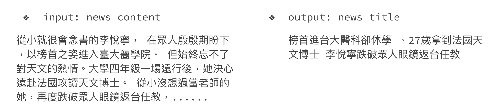

# Chinese News Summarization

This project aims to generate titles for Chinese news using mT5-small model.

<p align="center">
  
</p>

## **Prerequisites**

- Python 3.9

## **Repository Structure**

- **`requirements.txt`**: List of Python packages required for this project.
- **`download.sh`**: Script download training data and a pre-trained model.
- **`download.py`**: Script called by `download.sh` to handle the downloading process.
- **`run.sh`**: Bash script to run the inference code.
- **`inference.py`**: Python script that performs inference using the pre-trained model.
- **`train_src`**: Folder containing additional resources for training models on your own.
- **`report.pdf`**: Explanations of the hyperparameter sweep and generation strategies.

## **Setup**

### **Step 1: Clone the Repository**

```bash
git clone https://github.com/Hannibal0420/Chinese-News-Summarization.git
cd Chinese-News-Summarization
```

### **Step 2: Install Dependencies**

Install the required Python packages and inference model using the following command:

```bash
pip install -r requirements.txt
bash ./download.sh
```

## **Run Inference**

To run the inference code, execute the **`run.sh`** script with the following arguments:

- **`${1}`**: Path to **`input.jsonl`**
- **`${2}`**: Path to **`output.jsonl`**

```bash
bash ./run.sh /path/to/input.jsonl /path/to/output.jsonl
```

**Note**: Make sure to replace **`/path/to/input.jsonl`** and **`/path/to/output.jsonl`** with the actual paths to your files. To use the example code in this repo, you can run as below.

```bash
./run.sh ./data/public.jsonl ./output.jsonl
```

## Train Your Own Model

In the **`train_src`** folder, you can fine-tune existing models or train from scratch and track the process with Weights & Biases toolkits. These codes are modified from this source:

- Summarization: [Transformers model](https://github.com/huggingface/transformers/blob/main/examples/pytorch/summarization/run_summarization_no_trainer.py) on a extractive and abstractive summarization dataset, like CNN/DailyMail

## **License**

This project is licensed under the MIT License - see the [LICENSE.md](https://chat.openai.com/c/LICENSE.md) file for details.
